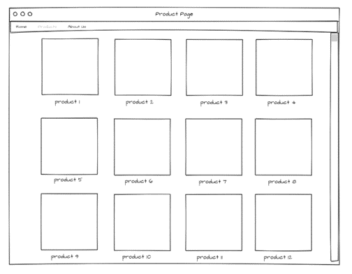

# 第一课 网络开发入门
[查看课件点这里](第一课网络开发入门.pdf)

# HW1
<!-- Hi, welcome to the first assignment. -->

## Name
<!-- TODO: Please type your full name in the following line. -->
Yimin Zhu

## Hierarchical Outline of Personal Page
<!-- TODO: Please list content of personal page starting at the following line. -->
dsfghjkhgfdsadfgchvjbnmkbvcxfds

dsvfbdghjmgnfdbvfbg

fdsaghghdfjgdfsdgf

## Mockup Website for CAN Borneo
<!-- The format of inserting an image is:  -->
<!-- 1. Upload the image. -->
<!-- 2. Replace "alt text" with the text you would like to show in case that image is unavailable. -->
<!-- 3. Replace "filename" with the name of the uploaded image. -->
<!-- TODO: Add images for mockup website in the following line. -->

## Interview Questions
<!-- TODO: Add the questions for interview in the following lines. -->
1. sdfghjkl
2. dfghjn
3. xfcghvbjn
4. sdfghj
5. sfdghjk
